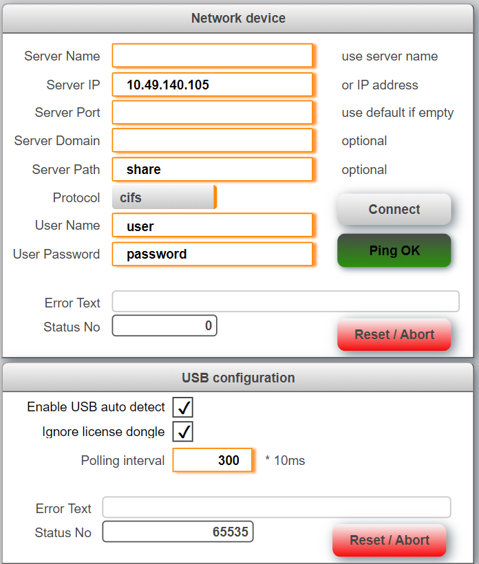

## Table of Contents
* [Introduction](#Introduction)
* [Requirements](#Requirements)
* [Description](#Description)
* [Pre Configuration](#Pre-Configuration)
* [Post Configuration](#Post-Configuration)
* [Limitations](#Limitations)
* [Error Messages](#Errors)
* [Revision History](#Revision-History)

## Introduction
This is a sample project for a file Explorer with mappView. It allows you to copy and delete files between multiple locations.

Also see [**How to import the user management into an existing project.**](Logical/mappFileExplorer/HowToImport.pdf) Download the latest release from [**here.**](../../releases)

## Requirements
* Automation Studio 4.5
* mappView 5.7.1
* Automation Runtime B4.53

Recommended task class is #8 with a 10ms cycle time.

## Description
The sample consists of three tasks and a mappView sample page. The task FileExplorer handles the majority of all functions. The two additional helper tasks USBdevice and NETdevice allow the connection of USB sticks and network devices. The USBdevice tasks auto detects connected USB sticks and automatically mounts these so they can be accessed from the FileExploer. The sample page shows all available functions and can be used as a starting point. The following functions are currently supported.

* Copy one or all files or folders
* Delete one or all files or folders
* Create a new folder

The task and mappView visualization use an interface to communicate that can also be used to trigger functions external. Since there are two sides in the file explorer most data exists twice. The structure looks as follows:

	EXPL
	* CMD		Used to trigger commands like copy, delete, create, ... A command is triggered by setting it to true, when the command is finished the task will reset the command. This indicates that the command is finished. Do not change any parameters or set another command until the previous command is finished. 
	  * refresh 	Read files and folder information
	  * dir_change 	Change to the folder name stored in PAR->dir_name
	  * dir_create 	Create new folder
	  * copy 	Copy selected file or folder
	  * copyall 	Copy all files and folders
	  * delete 	Delete file or folder
	* PAR 			Parameters
	  * device_active 	The device name that is currently used, see constant definition below
	  * device_list 	List of all available devices name that can be used, see constant definition below
	  * item_filter 	Only files and folders that fit this pattern will be listed
	  * UserRole 		The user role used with the assign and remove command
	  * dir_name 		Folder name used with the command dir_create
	  * dir_path 		Complete folder path 
	* DAT		File and folder information
	  * item_list	List of files and folders
	  * item_size	File size
	  * item_num	Number of files and folders
	  * UserActive	This is the user that is currently logged in
	* VIS				Data specific for the visualization
	  * item_selected		File or folder that is selected in mappView
	  * enable_copy_delete		Enables/Disables the buttons to copy or delete a file
	  * enable_refresh_create	Enables/Disables the buttons to create or refreash a folder
	  * double_click_dir_change	Helper variable to detect double click on itelm list
	  * device_list			Same information as PAR->device_list but formated for mappView  
	* ERR		Information about errors
	  * txt		Error text
	  * nr		Error number
	  * step	State where the error occured

## Pre-Configuration
The sample can be pre-configured through the following constants located in mappFileExplorer->ExplorerVariables.var

	DIR_PATH_SIZE 	Maximum length for the complete path
	ITEM_LIST_NUM 	Maximum number if files and folders that can be listed
	MAX_ITEM_SIZE 	Maximum length for a file or folder name
	DEVICE_LIST   	List if predefined devices

## Configuration at runtime
The following settings can be changed during runtime. For details about the network settings see the Automation Help (6bc04f87-a564-42fe-be38-060045eb83d6).

## Limitations
* The sample is not yet multi client capable.
* There is no extra message box when files or folders are deleted.
* The network needs up to two minutes to time out if the corresponding is not available. This time must also be considerred when the server address is corrected. Even in this case it can take a few minutes to connect to the correct server.

## Error messages
	50000		Selected item name is empty										
	50001		This is not a valid item name											
	50010		Device is not defined												
	50011		Item list is not defined											
	50012		Maximum entry parameter is 0											
	50100		Maximum number of files reached		-> increase value of ITEM_LIST_NUN					
	50200		File name exceeds maximum length	-> increase value of MAX_ITEM_SIZE					
	50201		Directory name exceeds maximum length	-> increase value of MAX_ITEM_SIZE					
	50202		Directory path exceeds maximum length	-> increase value of DIR_PATH_SIZE			
	50203		Directory path critical error

## Revision History

#### Version 0.2
- Added configuration for network connections
- Code cleanup

#### Version 0.1
First public release
